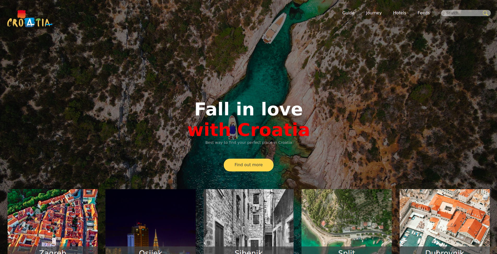
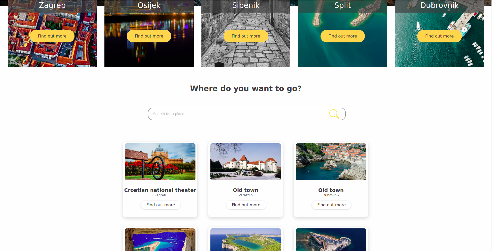
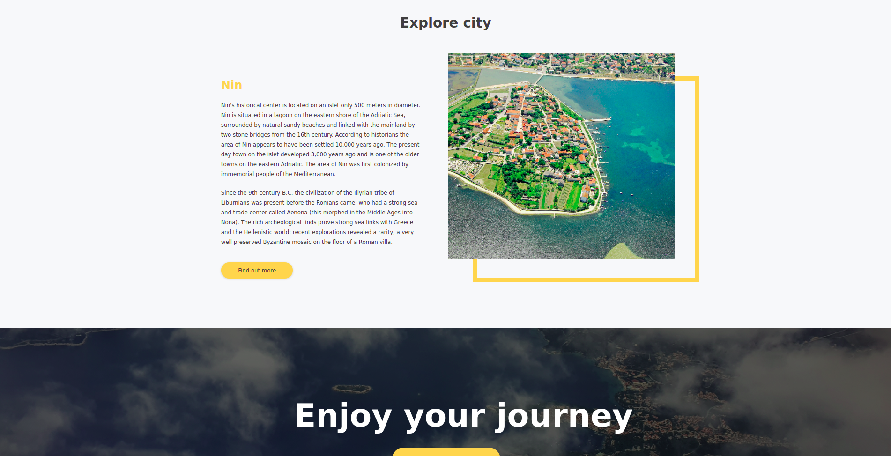

# Croatia tourism website
> website created using css, html and a tiny bit of java
## See it live
[Croatia tourism website live on github](https://daliborkoenig.github.io/Croatia_tourism_website/)
## App Info
the course exercise was to choose a websity style on symu.co and then recreate it using HTML and CSS. 

I choose this template:
https://symu.co/freebies/templates-4/polind-psd-template/ and recreated it from scratch just by looking at the picture.

- search bars are functional and redirect to google
- all links are functional
- working visitor counter at the end
- responsive as much as i know how.
### Author
Dalibor Koenig
### Version
1.0.5
### License
This project is licensed under the MIT License

